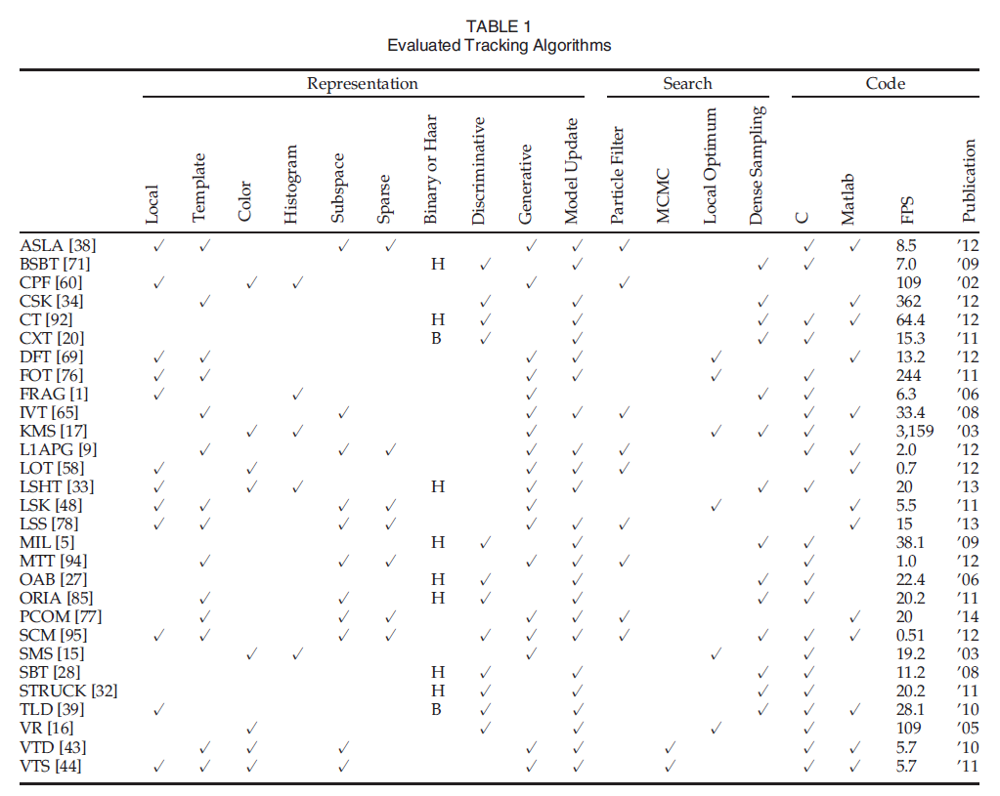
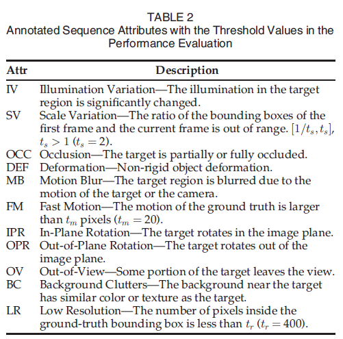
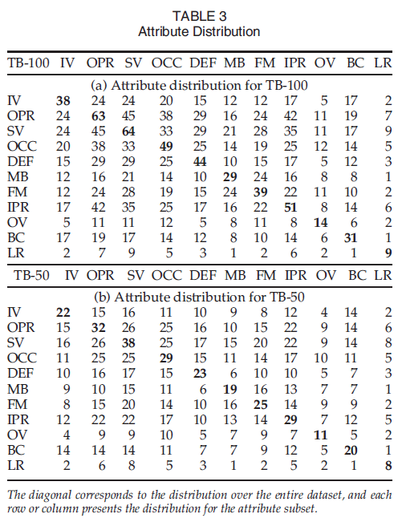
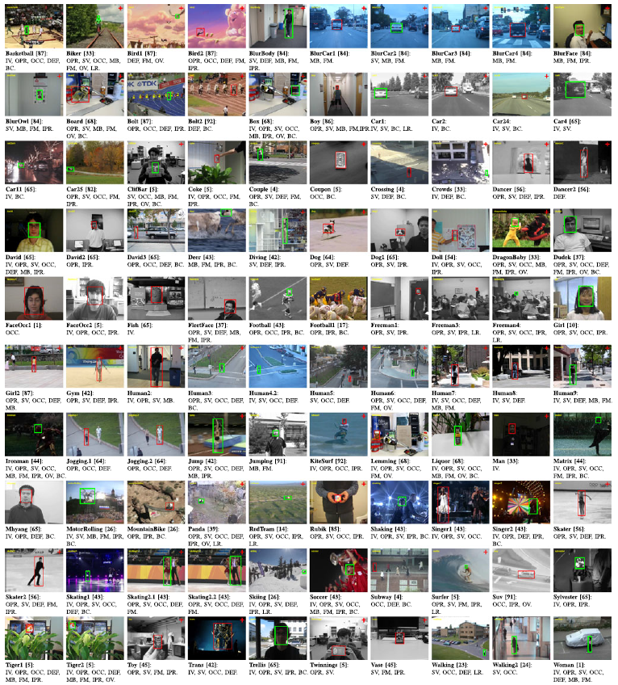

# 统一的测试平台与标准
# OTB-15 (Object Tracking Benchmark)
---
## *Abstract*
- the set of sequences is often not sufficient or is biased
- construct a large dateset with groundtruth object positions and introduce the sequence attributes  
- integrate most of the trackers into one code library  
- evaluate 31 algorithms on 100 sequences, identify effective approaches

---
## *Introduction*
- 大部分已有的trackers评判的指标不同，评判使用的视频也不同，追踪器的输入也不同，视频的groundtruth(gt)标注的结果也不一样，因此无法对比追踪器的优劣
- 由于追踪算法都是给定第一帧的目标gt，后续帧通过追踪器给出，因此第一帧尤为重要，为了减少算法对于第一帧的敏感程度，我们提出了在时间上和空间上重新初始化第一帧
- 全文贡献：  
1.标注了100个视频，适合单目标追踪  
2.编写了代码仓库，提供了统一的视频评价接口  
3.提出了新的评价指标  

## *Brief review of object tracking*
#### Representation scheme
- 追踪算法大部分框架都是物体表征，从稀疏表征到基于颜色直方图，再到如今的判别类模型，具体算法以及简介详见原文
#### Search mechanism
#### Model update
- 为了提高追踪的鲁棒性，最早提出了将当前帧与第一帧一起更新模型
- 随后提出了采用半监督的方式更新模型
#### Context and fusion of trackers
- 还有算法提出了采用追踪物体的周围物体辅助追踪，尤其是针对追踪目标被周围物体遮挡的情况，通过同时追踪周围物体推断被追踪目标的位置
#### Performance evaluation
- 现有的评价指标还不够好
- 缺点有被评价的trackers和视频太少
- 很多追踪算法对于第一帧的gt过于敏感，增加了评价难度
#### Challenging factors
- occlusion 遮挡
- deformation 变形
- scale variation 尺度变化
- fast motion 快速移动  
以上种种追踪难题的解决办法以后补上，不过目前算法也是针对某一类问题专门研究，没有一个统一的解决所有问题的方法  

## *Evaluated tracking algorithms*
- 看这张表就比较清楚地了解前面作者对追踪算法回顾的表征方法，追踪方法的介绍了，换句话说追踪本质上分两块，第一块就是学习什么样的目标区域特征，第二块拿着设计好的学到的特征去后续帧匹配，以什么样的方法匹配，或者说是以什么样的度量学习方法比较相似性  

  

## *Datasets*
- 首先，作者采用了以下11种特征标注了所有的100个视频，每个视频可以被打上多个标签  

  
- 整个数据集的各个标签分布如下图：  

  
- 整个数据集的首帧以及bbox如下图：  

## *Evaluation methodology*
- 提出了两个新的评价指标，比如如果一个视频对于第一帧bbox追丢了，但是几帧后重新给bbox又能够追到，则这个也是一个不错的追踪器
- Precision Plot  
1.定义：追踪器给出的bbox与gt中心点之间的欧拉距离，普遍评价采用偏差距离在20像素的值   
2.采用距离在一个阈值内的百分比而不是距离的平均值，因为当追丢了物体，这个距离就是一个随机值，因此采用在一个阈值内的帧数百分比更好  
3.缺点：只比较了物体的中心点之间距离，没有尺寸和尺度变化的衡量
- Success plot  
1.定义：追踪器给出的bbox与gt面积的交集与面积的并集之比S  
2.Average overlap score(AOS) 也就是定义中的S大于某一个值的帧数百分比  
3.等同于2中的AOS我们也可以采用area under curve(AUC)来评价，但是其实和AOS正比关系，不再赘述  
### Robustness Evaluation
- One-pass evaluation(OPE)  
1.定义：给定第一帧的gt，后续帧的bbox都要通过追踪器自己给出，不管是否追丢  
2.缺点：相近帧分别作为第一帧可能对产生很不相同的追踪结果，很多追踪器不带有丢失重新检测，因此追丢了以后的bbox没什么用  
- Temporal robustness evaluation(TRE)  
1.定义：分别以不同帧作为起始帧开始追踪，最后平均一下求结果，因此是时间上的不同  
- Spatial robustness evaluation(SRE)  
1.定义：对于初始帧的尺度和尺寸进行改变，检查追踪器是否对人为的标定小偏差比较敏感  
2.提出原因：由于人为标注数据集可能bbox偏差几个像素格，如果这对追踪器产生了较大的追踪偏差，说明追踪器不够鲁棒  
3.偏差的具体值：尺寸偏差八个（四个中心移动和四个角方向移动）+ 尺度偏差四个（原尺寸0.8到1.2倍大小）= 总共12个偏差检测  
OPE, TRE, SRE配图如下：  

  
### Robustness Evaluation with restart
- 针对物体追丢，没法重新检测到物体而制定的检测方法
- OPER与SRER

## *Evaluation results*
### Overall performance
### Performance of SRER
### Performance analysis by attributes
### Tracking speed
- 详见表一
