# 多尺度的全卷积孪生+互相关
# Fully-Convolutional Siamese Networks (SiamFC)
---
## *Abstract*
- online-only approach limits the richness of the model  
- unsuitable for unknown object beforehand 
- Siamese network

---
## *Introduction*
- 追踪区分于分割的主要在于类别不确定性，换句话说要追踪的物体可能不属于实现训练过的某一类，因此追踪需要设计一些更一般的函数对比相似度而不是针对每一类物体训练固定的参数
- 传统的追踪器从第一帧提取特征，后续帧直接对比提取的特征相似度，这种方法限制了模型学到的特征，其实这类思想和加入深度学习很相似，只是人为设计的特征相对CNN比较局限，可能是其中的某些特例  
- 本文改进了Siamese网络，比SINT更进一步不是输入两个相同尺寸的区域，而一支是目标exemplar，一支是instance，因此网络的汇合区域做了一次互相关  

## *Deep similarity learning for tracking*
- 定义：z(127x127x3)为目标区域，x(255x255x3)为实体区域  
- 网络目标：学习一个相似度对比函数f，输入z和x，输出一张score表明两者的相似度，越相似数值越大  
- 相似函数f由两部分组成，第一部分先对x，z进行卷积，即特征提取，随后的函数g进行互相关，比较两个卷积后特征的相似度，最后函数的输出不是单一的向量，而是二维的score map，这也体现了fc的思想

## *Training part*
- **按照原文零散的顺序先来一遍**   
-- 先定义score map上单个点的loss，采用逻辑回归的loss思想，也就是信息gain，loss函数l(y, v)：  

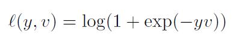

  
-- 有了l函数以后可以求得score map上17x17个点的所有loss然后求平均就有了一个pair的loss：  

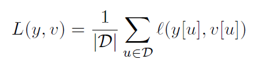

  
-- 优化器：SGD，可能为了追求能够达到更小的loss   
-- 训练的pair：将追踪的bbox物体放在图像正中心，这样可以label只生成一次，同时图像的尺寸大小不进行拉升变化，当尺寸超过原图打小时，用全图的平均值填充，效果如下：  

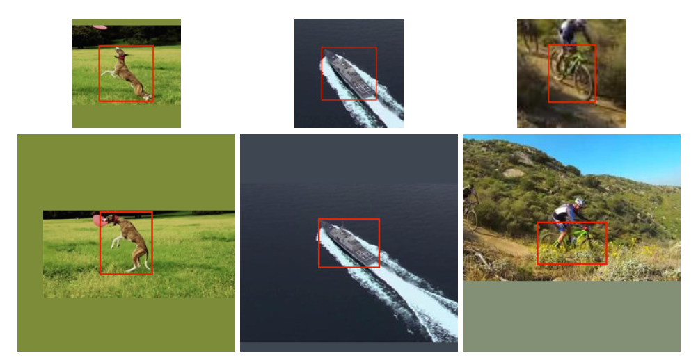

  
-- 计算loss时候加入了权重，因为正样本区域和负样本区域的数量不均衡，13:17x17    
- **自己整理一遍训练顺序**  
-- 图像预处理以及分别保存，生成训练和测试数据集  
-- 分别定义网络，优化器（SGD），学习率参数等  
-- 自定义loss，使用和逻辑回归一致的loss（实际pytorch复现负样本直接定义0，计算交叉熵损失）  
-- 全局生成一次label，由于目标区域中心化，所以所有的label都一样，label和weight分别如图：  

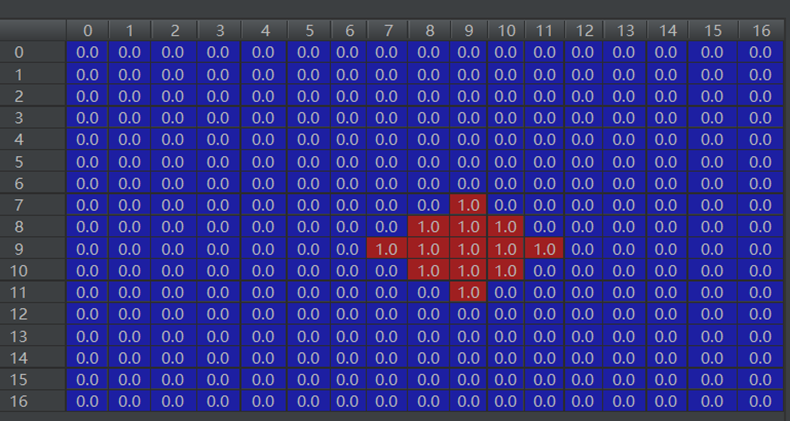

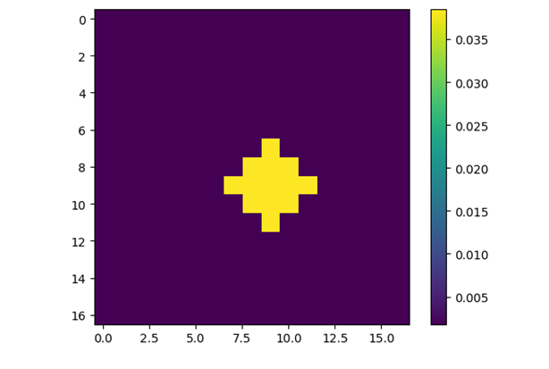

  
-- 开始迭代更新参数      
-- 网络结构    
>self.feat_extraction = nn.Sequential(  
	nn.Conv2d(3, 96, 11, 2),            
    nn.BatchNorm2d(96),
	nn.ReLU(inplace=True),
    nn.MaxPool2d(3, 2),
    nn.Conv2d(96, 256, 5, 1, groups=2),  
    nn.BatchNorm2d(256),
    nn.ReLU(inplace=True),
    nn.MaxPool2d(3, 2),
    nn.Conv2d(256, 384, 3, 1),           
    nn.BatchNorm2d(384),
    nn.ReLU(inplace=True),
    nn.Conv2d(384, 384, 3, 1, groups=2), 
    nn.BatchNorm2d(384),
    nn.ReLU(inplace=True),
    nn.Conv2d(384, 256, 3, 1, groups=2)  
)

## *Tracking part*
- **直接整理一遍顺序**  
-- 加载训练好的网络    
-- 加载第一帧并求取每层平均值      
-- 求w+2p, h+2p, s    
-- 裁剪出127x127的目标区域    
-- 事先求提取目标第一帧z_feature，后续追踪也不更新，所以事先求好可以加速     
-- 事先准备window用于整流    

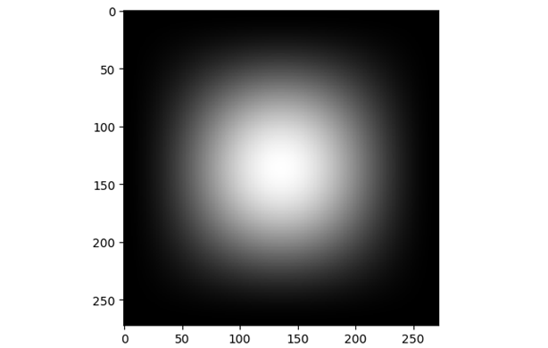

  
-- 开始追踪  
-- 加载第2帧图片   
-- 求取三种/五种追踪区域大小，并生成相应scale的图片 255x255  

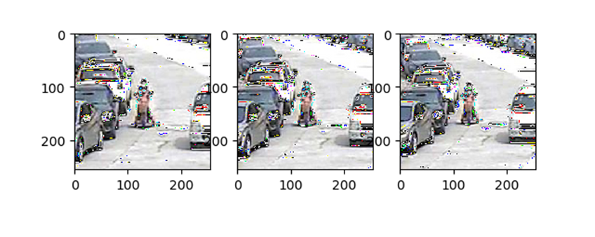

  
-- 求取所有scale图片的x feature    
-- 得到score map，上采样为272*272  

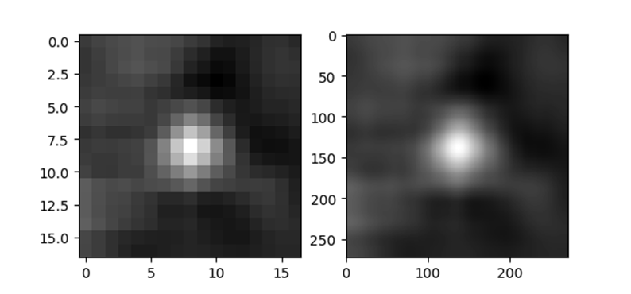

  
-- 评比三种/五种上采样map的最大响应，得到最好的scale并进行汉宁窗平滑  

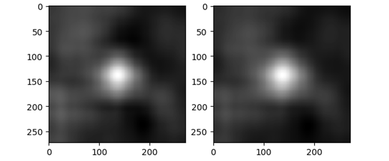

  
-- 计算最好的scale对应的图像在原始图像中的位置，乘以对应比例加上被裁减图片从原图中切出的位置，得到最终的位置    
-- 继续下一帧追踪    

## *Dataset*
- 采用ImageNet Video for tracking
- 原因有二：  
第一：视频的数量超过4500个，超过100万帧图片，因此相比其余VOT，OTB加起来不到500个视频要多很多；  
第二，防止学习的模型对于OTB等数据集的场景过拟合，因此采用另一个数据集训练

## *Dataset curation*
- 对于exemplar和instance分别裁剪为127x127和255x255的区域，如果图像小于这个区域大小，则通过比例因子进行调节，公式如下：

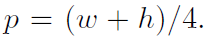

  
- 我实际裁剪以后发现追踪区域的size还是会发生一些轻微的变形，并且通过双三次插值进行了补齐，如下图，引入了一些插值点

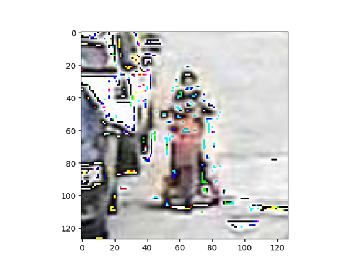

  

## *Related work*
- 目前RNN还没有很成熟的追踪理论，展望孪生网络与RNN结合，运用于追踪
- 使用RBM无监督学习进行追踪，目前只适用于人脸和行人追踪
- 评价了SINT，采用了ROI池化，对于bbox回归来提高目标区域的预测，但是由于重复多次取样，所以实时性不够
- 最终，批评了所有MDNet，SINT和GOTURN网络都是采用了OTB，VOT的数据，这些数据是同一个大数据集的数据，因此不能够证明自己模型的泛化能力

## *Experiments*
- **Implementation details**  
-- 初始化参数采用Xavier方法，服从高斯分布，每一个epoch包含5万对数据，batch_size=8，lr=1e-2 ~ 1e-5  
-- 虽然初始的搜寻区域是255x255，但是上采样为277x277，作者发现效果更好    
- **Evaluation**  
-- OTB-13 （竟然比SINT还低，可能由于数据不是OTB等相关数据集训练的结果）  

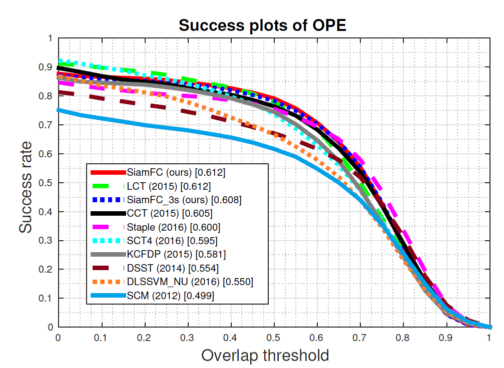

  
-- VOT等结果详见原文   
-- 最后作者还提到增大数据集会对最终网络效果有显著提升，200万张图片还远远不够  
-- 附上一张原文的追踪图  

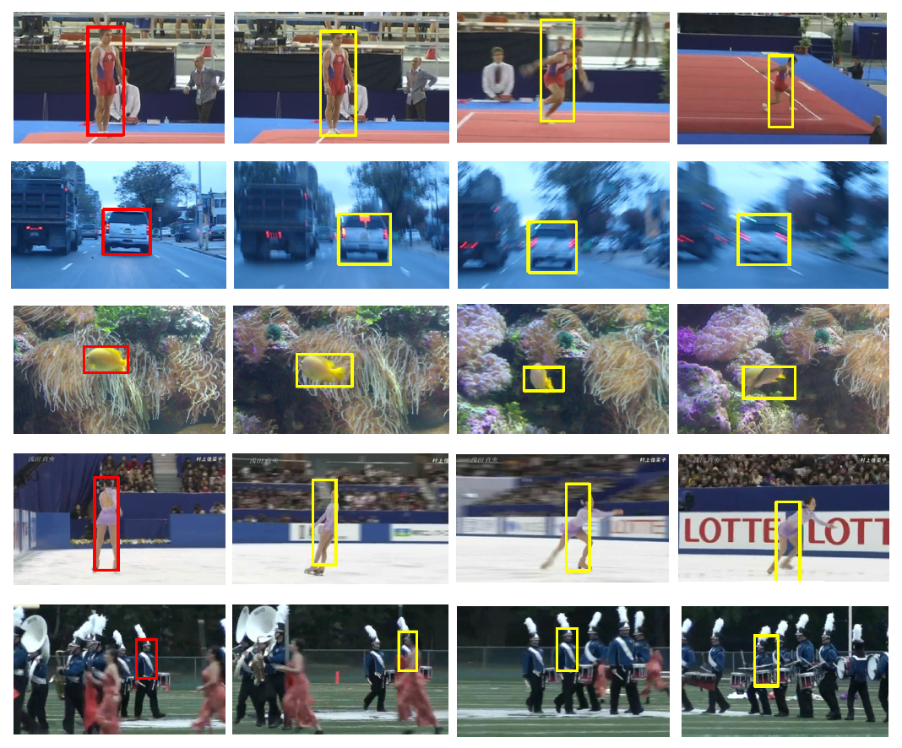

  

## *Resources*
- **原文：**  
[Fully-Convolutional Siamese Networks for Object Tracking](https://arxiv.org/abs/1606.09549)  
- **代码：**  
[https://github.com/bertinetto/siamese-fc](https://github.com/bertinetto/siamese-fc)