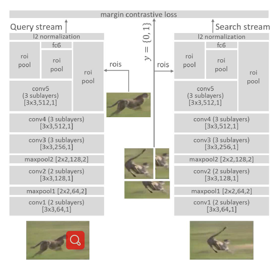
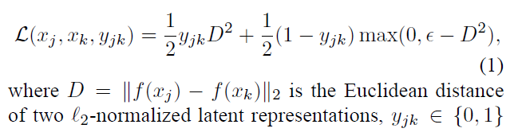
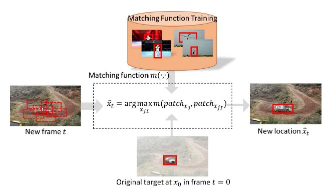

# 孪生跟踪鼻祖
# SINT (Siamese Instance Search for Tracking)
---
## *Abstract*
- no model updating, no occlusion detection, no combination of trackers, simply use the first frame
- Siamese deep neural network
- allow for target re-identification

---
## *Related Work*
- **Matching functions in tracking**  
-- 本质思想：找到exemplar的特征，然后进行匹配  
-- 传统算法采用正则化的互相关，或者是概率的相似函数，这些算法有TLD，LK，MST等。  
-- 本文采用DNN学习exemplar和instance之间的关系  
- **Recent tracking methods**  
-- 本文追踪采用了每一帧图像与第一帧的exemplar对比，找到匹配度最高的区域    
- **Deep learning in tracking**  
-- 之前的算法：采用自编解码器追踪，效果差；采用分类器对不同类别追踪，最终缺乏数据无法训练；只训练某几类事物的追踪，过于局限  
-- 本文的创新在于采用了所有视频训练一个普遍的追踪器，能够适应各种物体的追踪  
- **Siamese architecture**  
-- 孪生网络最早提出用于签名比对和人脸区别，作者认为这是一个无监督的学习过程，很适合少样本多种类的区分  
- **Fast localization**  
-- 擦用了roi池化，可以应对多目标追踪  

## *Siamese Instance Search Tracker*  
- **Matching function**  
-- 设计了两种孪生的分支，Alexnet简单版和VGG的加深版  
-- 设计中减少了最大池化，因为最大池化能够对抗物体变形，降低物体的空间分辨率。换句话说，追踪中比较重要的是了解物体的空间位置与状态，最大池化后这些信息都将损失，但是对于分类问题这是一个好处，因为这个具有极大的抗噪声能力  
-- CNN的浅层能够反映物体的底层信息如轮廓，颜色等，深层能够反映语义信息，如前后背景等更具有区分度的信息。由于不明确哪一类信息对于追踪更有用，因此浅层深层信息融合，网络结构详见下图   

- **Network input**  
-- 定义：网络的两支exemplar称为Q(Query)支，instance支称为S(Search)支  
-- S是从一帧中裁剪出和追踪区域一样大的region，按照区域和bbox的重合度定义正负样本，为了提高鲁棒性，S的图片可以提取自任意帧，这两点和后面的SiamFC差别挺大    
- **Loss**  
-- 挺关键的一部分，不过设计的和人脸识别的挺相似的  
-- loss的解释可以理解为对图像进行编码以后的高维空间中距离的对比，相似物体的距离足够近，不相似的足够远，因此定义了欧拉距离，相似物体的欧拉距离与loss正比，不相似的应该满足的一个最小距离值，loss公式详见下图  

- **Tracking**  
-- Candidate sampling: 增加了尺度变化的不同尺寸的候选框
-- Box refinement: 对x, y, w, h训练四个岭回归得到更精确的值  
-- 追踪时候得到匹配度最高的bbox区域，作者认为应该体现在候选区域进去欧氏距离最近的地方，也就是最小值，追踪详见下图 

  

## *Experiments*
- **Implementation Details**  
-- 候选框采用三种尺寸，这应该也是影响SiamFC的一点  
-- 数据集采用ALOV，大于0.7的正样本，小于0.5的负样本，总共60000对样本，每对包含128对样本，应该包含正负样本  
-- 几个对比试验结论：使用vgg的效果比alex要好，不使用最大池化效果更好，使用多层信息融合的效果更好  

## *Resources*
- **原文：**  
[Siamese Instance Search for Tracking](https://arxiv.org/abs/1605.05863)  
- **代码：**  
[https://github.com/taotaoorange/SINT](https://github.com/taotaoorange/SINT)

